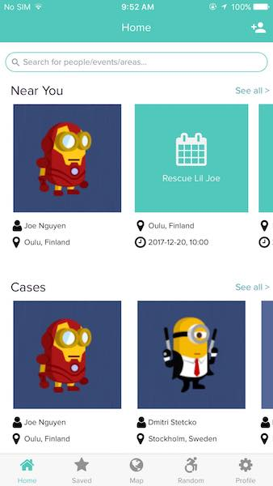
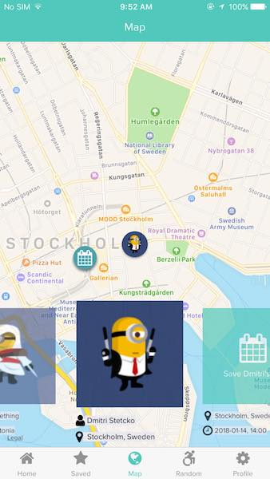
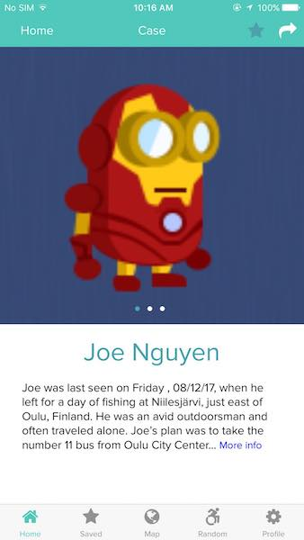
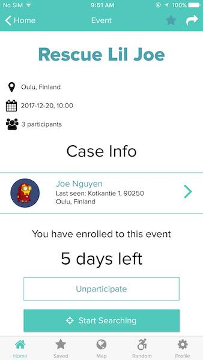
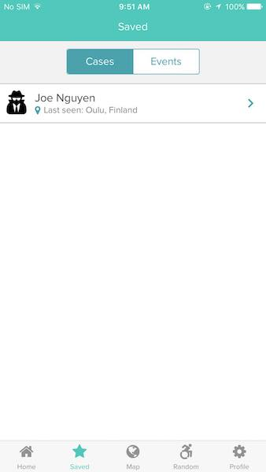
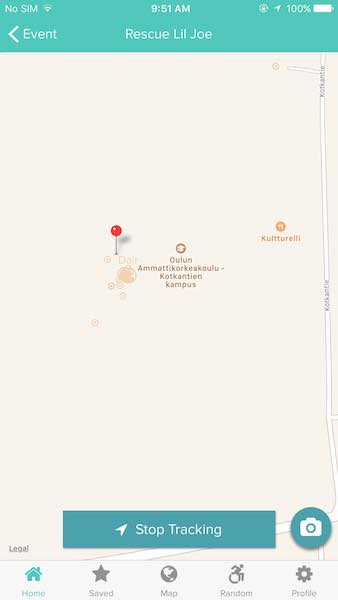
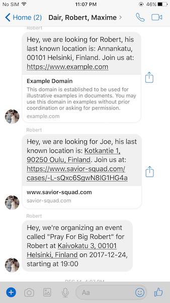
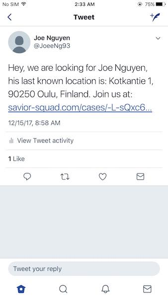
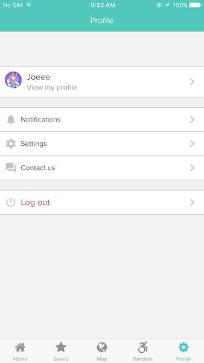

# Savior Squad
Mobile app built with React Native that can be used to organize events, search for missing people, etc. (OAMK UI Design Course)

## What can you do as an user
- Post/Follow missing cases (people) so that everyone around the world can track if interested
- Organize/Follow events for missing people such as massive searching, info sharing, etc.
- Real-time location tracking for volunteers during search events, meaning that people participating in a search event can see each other's location in map
- Share missing cases on social media (Facebook, Twitter, etc.)
- Save interested missing cases and events

## Demo

*Fig 1. Home Screen*

*Fig 2. Map Screen*

*Fig 3. Case Info*

*Fig 4. Event Info*

*Fig 5. Saved Cases*

*Fig 6. Realtime Tracking*

*Fig 7. Social Share (FB Messenger)*

*Fig 8. Social Share (Twitter)*

*Fig 9. Settings*
